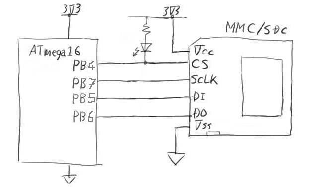
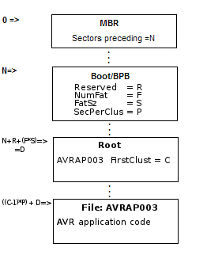

# sdbootloader
## A compact bootloader for FAT16/32 on SD/MMC cards

This is a bootloader for small AVRs that will fit into a 2K BLS and without requiring SPI (just four IO lines) it can read an SD card, search the root directory for a file called AVRAPnnn.BIN (where nnn is a version number) and if nnn on the card is a higher number than held in flash (version number held in EEPROM) it replaces the application section of the flash with the file contents.

 

OK the idea isn't new. But hopefully this implementation is. I wanted to write a bootloader that would fit in 2KBytes of a mega16 and would therefore be suitable for a lot of small AVRs. There are other SD/MMC reading bootloaders but because they tend to use the whole of [Fat-Fs](http://elm-chan.org/fsw/ff/00index_e.html) or [Petit-Fs](http://elm-chan.org/fsw/ff/00index_p.html) they struggle to be so small. So I simply took the mmc.c from Petit-Fs (and the asmfuncs.S) which builds to be about 800 bytes to give card init and sector read functions (and the SPI and flash handling code) and then see how little additional code it would take to find a file on an SD card and use that to program the application flash.

The SPI code from Chan does software SPI so this can run on AVRs without SPI or on any 4 chosen pins on an AVR, not necessarily just the dedicated SPI pins. As shown in the image the code defaults to PB4..PB7 (same as real hardware SPI pins in fact) and that's what was used throughout development/testing.

An assumption is made that the card has FAT16 (not FAT12 or FAT32) format to simplify things (though see FAT32_SUPPORT decribed below). It's then possible that sector 0 on the card could be either an MBR (partition table) or a BS/BPB (Boot sector and BIOS Parameter Block). So I read that sector and try to determine which. If it looks like an MBR I make an assumption that the 1st partition entry is used and use only the "sectors before" field in that to determine where the BS/BPB is.

Once the BS/BPB is located I apply the FAT16/(FAT32) interpretation and read various fields in order to determine where the root directory and data clusters are located. Having found the root directory I then search for the first entry that has the five letters **AVRAP** at the start. I then make a further assumption that the next 3 characters will be digits and read/convert to binary. This tells me the version number of the app image in the file. I also store a flash image version number in the last two bytes of EEPROM memory so I then compare the two and if the file version is higher than the stored EEPROM version I wipe the EEPROM location back to 0xFFFF (as a marker to say that there is no valid app) then use the "First Cluster" field of the file entry to locate the first cluster of the file.

For the entire app section (14K in case of mega16) I then read sectors from that file and in groups of four (sector = 512, SPM page = 128) I program the flash pages in the application section of the AVR. At the end I finally store the new file's version number into EEPROM again to mark the code as being valid.

At startup when either no SD is found or any AVRAPP is found to be equal or less than the EEPROM version number I then just try to launch the app. Now at build time for the application I used srec_cat:

   `srec_cat $(MSBuildProjectDirectory)\$(Configuration)\$(Output File Name).hex -intel -fill 0xFF 0x0000 0x37FE --l-e-crc16 0x37FE -o AVRAP001.bin -binary`

which takes the .hex file, pads all the unused aera wit h0xFF up to the last 2 bytes then it fills those last two bytes with a CRC16 checksum of the entire image. All that wil have been programmed in to the application flash by the bootloader.

The bootloader then applies the same CRC16 algorithm to the stored app code up until the last two bytes then checks against those bytes. It only enters the code when that validity check passes. The code can be made without the CRC_FLASH define to turn off this behaviour. The code can also be built with UART_DEBUG on in order to enable copious 38,400@3.6864MHz output of what's going on.

The work was done on STK500+JTAGICEmkII with ATmega16 (later ATmega32) and a 1GB microSD in an SD/MMC carier. It is FAT16 with 16K clusters. The code also tested with larger SD cards that are FAT32.

Note that because this bootloader has been built to fit into a very small bootloader space there are some necessary restrictions on its operation. For one thing it can find the root directroy but when looking for the AVRAP file it only considers the first 512 byte sector so the file has to be one of the first 16 entries in the root directory (but see new ROOT_MULTISEC build option). What's more as soon as the text AVRAP is found it stops looking. So if you copy AVRAP003.BIN and then AVRAP007.BIN to a card it will only "see" AVRAP003 as that comes first and stops the search. In use this means it's best to (a) use a card with virtually nothing else on it and (b) for each update delete the existing AVRAPPnnn.BIN file then copy the new AVRAPn+1.BIN to it (so it reuses the previously used position in the root directory).

If you look at configure.h there are a number of #define's that can be used to switch on/off various features in the build. A comment there describes which are on and which are off by default. With default choices the code is well under 2K so will fit into the BLS of a mega16 (max 2K). Other options can be switched on if a larger BLS is available. As an example these are the build sizes for an ATmega32:

`All options enabled:   2596 bytes (too big for 2K!)
-CLUSTER_SUPPORT:      2154 bytes (442 bytes)
-FAT32_SUPPORT:        2042 bytes (112 bytes)
-UART_DEBUG:           1668 bytes (374 bytes)
-FLOOD_RAM:            1652 bytes (16 bytes)
-ROOT_MULTISEC         1502 bytes (150 bytes)
-CRC_FLASH:            1406 bytes (96 bytes)`

**CLUSTER_SUPPORT** allows the AVRAPnnn.BIN file to span more than one cluster. As clusters are typically 32KB you only need this if the app images you are programming are likely to be >32KB (or whatever the cluster size is). As such you probably don't need this option on and can save a massive 442 bytes by turning it off.

**FAT32_SUPPORT** probably does have to be switched on these days. Most SD cards are 1GB or larger and that means they are likely to have FAT32 format, so this wil be needed. If you use small/old FAT16 cards or you reformat your larger cards with FAT16 then you can turn this option off to save another 112 bytes.

**UART_DEBUG** is just useful when first installing/testing the bootloader to get an idea of what's going on so that can easily be switched off to save 374 bytes.

**FLOOD_RAM** (and FLOOD_VALUE) just arrange to write all of RAM with a given value which is useful in debugging to monitor which parts of RAM are being used by the debugger. It can easily be switched off though at just 16 bytes it's unlikely to be a worthwhile saving.

**ROOT_MULTISEC** chanegs the code so that instead of just reading/searching a single sector (first 16 entries of root) it reads through the entire first cluster (possibly 1024 file entries or more)

**CRC_FLASH** as explained above turns on a verification mechanism (both immediately after programming and at each subsequent power on) that uses a CRC16 embedded in the application image but this does make the app more complex to build and it adds 96 bytes to the bootloader. It also means that power on is slower as all the app space is read/checksummed each time. So you may well decide this is a luxury you don't need.

The configure.h also lets you set which PORT and pin numbers the SPI SD/MMC singals are located on. By default these are set to be the same as the hardware SPI of a mega16/32. As such, when the application code starts it can simply use real Petit/FatFs? using hardware SPI in place of the bit-banged SPI the bootloader uses. But by changing configure.h you can use any four pins of choice (some work would be required to split this onto different PORTs though).

Also in the configure.h is the ability to determine the location of the ubiquitous flashing LED - this is used to indicate that app code was not started and the bootloading process has failed.

Before building this project you must read configure.h and make wise choices about which features you do/don't want.